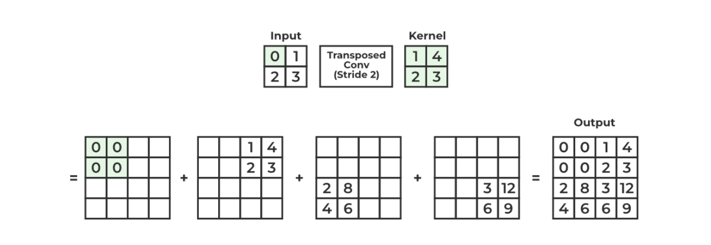

**What is a transposed convolution?**
Useful for tasks that involve upsampling the data
- Convultion operation performend in other dirextion
Slides input over the kernel instead of sliding kernel over input

Scalar mutliply kernel by value in the input, input by input. 
Then summate the outputs into one lange matrix

